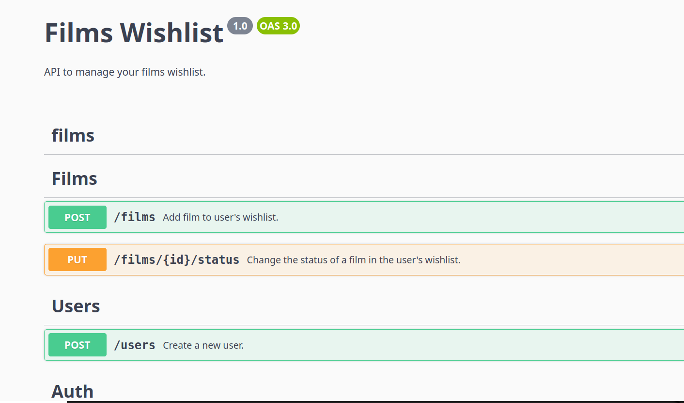

# Films wishlist :movie_camera:

REST API to help you manage the films you wanna watch or watched. Also rate and recommend (or not) the films you already watched.

## How to run

Rename the `.env.example` file to `.env`:

```sh
cp .env.example .env
```

Start docker services:

```sh
npm run docker
```

## Run migrations:

Due to [this issue](https://github.com/typeorm/typeorm/issues/10537), TypeORM only runs with Node version 18.18.0.

To run the migrations user the `.tool-versions` file to set the correct node version.

If you don't have this node installed, please install.

Suggestion:

```sh
asdf install nodejs 18.18.0
```

```sh
asdf local nodejs 18.18.0
```

Then run the migraions:

```sh
npm run typeorm migration:run
```

Now the app should be up and running.

## Swagger

We can see the endpoints documentation at `/api`:

[http://localhost:3000/api](http://localhost:3000/api)



## Run test

Unit tests:

```sh
npm run test
```

Integration tests

```sh
npm run test:integration
```

# Recomendação de filmes com base na 'wishlist' de um usuário.

Quando um usuário cria uma lista de desejos e adiciona um filme à essa lista, o sistema gera uma lista de recomendações com base em alguns dados do título e da sinópse dos filmes dessa lista.

## Solução técnica

Extrair entidades nomeadas do título e do resumo dos filmes. Em seguida, pesquisar no TMDB por novos filmes usando essas entidades encontradas como query.

## Extração de Entidades Nomeadas

## Classificação e Similaridade entre Textos


# Backlog

## Make case insensitive query to find film by name

https://github.com/typeorm/typeorm/issues/1231


## Update endpoint to change film status

Endpoint: `PUT /films/:id/status`

Nowadays this endpoint only changes status from TO_WATCH to WATCHED. 

Changes:
- Allow to rate a WATCHED film
- Allow to recommend a RATED film